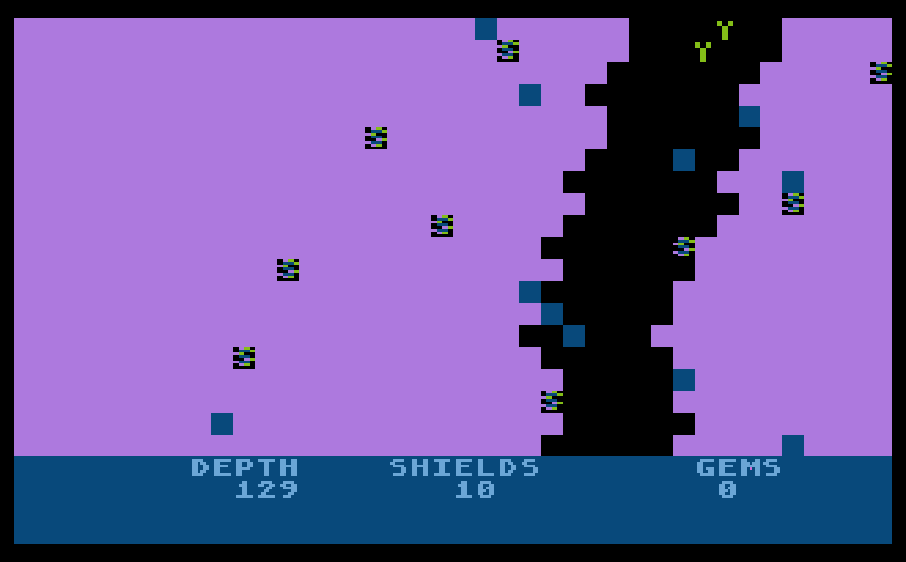

# 2017-Descend
Descend game in Turbo BASIC XL for Atari 8-bit. Entry for 2017 10-line BASIC contest

My first entry for the 2017 10-line BASIC programming contest is DESCEND, a port of my assembly language game [Kaverns of Kfest.](https://atariage.com/forums/topic/261831-kaverns-of-kfest-game/) Your job is to descend into the cave collecting gems, without hitting the walls. As usual, I did this project in Turbo BASIC XL on the Atari 8-bit.
